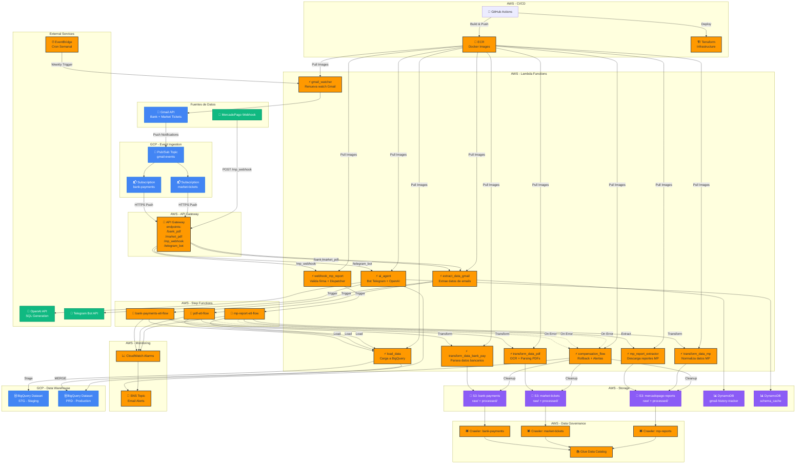

# 🏗️ Sistema ETL de Gastos Personales - Arquitectura y Documentación

<div align="center">

**Pipeline ETL automatizado de gastos bancarios y consumos con integración multicloud**

[](https://aws.amazon.com/)
[](https://cloud.google.com/)
[](https://www.terraform.io/)
[](https://www.docker.com/)
[](https://github.com/features/actions)

</div>

---

## 📋 Tabla de Contenidos

- [Descripción General](#-descripción-general)
- [Arquitectura del Sistema](#-arquitectura-del-sistema)
- [Flujos de Datos](#-flujos-de-datos)
- [Stack Tecnológico](#-stack-tecnológico)
- [Componentes Principales](#-componentes-principales)
- [CI/CD Pipeline](#-cicd-pipeline)
- [Seguridad y Gobernanza](#-seguridad-y-gobernanza)
- [Monitoreo y Alertas](#-monitoreo-y-alertas)
- [Consideraciones de Costos](#-consideraciones-de-costos)

---

## 🎯 Descripción General

Sistema ETL (Extract, Transform, Load) serverless y event-driven que procesa automáticamente gastos personales de múltiples fuentes:

### **Fuentes de Datos**

1. **🏦 Notificaciones Bancarias (Banco Santander)**
   - Gastos con tarjeta de crédito/débito
   - Débitos automáticos
   - Extracción en tiempo real vía Gmail API

2. **🛒 Tickets de Supermercado (Carrefour)**
   - PDFs de compras recibidos por email
   - Procesamiento con OCR y extracción de datos estructurados

3. **💳 Reportes de MercadoPago**
   - Reportes semanales automáticos de consumos
   - Integración vía webhooks

### **Objetivo**

Centralizar, procesar y analizar todos los gastos personales en una única fuente de verdad (Google BigQuery) para facilitar:
- Análisis financiero personal
- Visualización en dashboards (Looker)
- Consultas mediante AI Agent (Telegram Bot)

---

## 🏛️ Arquitectura del Sistema

### **Diagrama de Arquitectura**



---

## 🔄 Flujos de Datos

### **1️⃣ Flujo: Gastos Bancarios (Banco Santander)**

```
Gmail Notification → Pub/Sub → API Gateway → extract_data_gmail
    ↓
Guarda JSON en S3 (bank-payments/raw/)
    ↓
Step Function: bank-payments-etl-flow
    ↓
transform_data_bank_pay: Extrae monto, comercio, fecha, tarjeta, cuotas
    ↓
Guarda CSV en S3 (bank-payments/processed/)
    ↓
load_data: 
    - Carga a BigQuery STG.stg_bank_payments (TRUNCATE + APPEND)
    - MERGE a PRD.bank_payments (INSERT nuevos registros)
    ↓
✅ Datos disponibles en BigQuery para análisis
```

**Campos extraídos:**
- `id` (hash único)
- `message_id` (Gmail)
- `fecha_pago`, `hora_pago`
- `tarjeta`, `nro_tarjeta`
- `comercio`
- `cuotas`
- `monto`, `divisa`
- `date`, `extraido_en`

---

### **2️⃣ Flujo: Tickets de Supermercado (Carrefour)**

```
Gmail con PDF adjunto → Pub/Sub → API Gateway → extract_data_gmail
    ↓
Descarga PDF desde URL en email
    ↓
Guarda PDF en S3 (market-tickets/raw/)
    ↓
Step Function: pdf-etl-flow
    ↓
transform_data_pdf:
    - Extrae texto con OCR (pdfplumber + PyPDF2)
    - Parsea productos, precios, cantidades, categorías
    - Genera nro_ticket único
    ↓
Guarda CSV en S3 (market-tickets/processed/)
    ↓
load_data:
    - Verifica en archivos_ingestados (por nro_ticket)
    - Si es nuevo:
        • Carga a STG → PRD (carrefour_data)
        • Actualiza dim_producto (con fuzzy matching)
        • Registra en archivos_ingestados
    ↓
✅ Datos disponibles en BigQuery
```

**Campos extraídos:**
- `nro_ticket`, `fecha`
- `categoria`, `producto`
- `cantidad`, `peso`
- `precio_unit`, `monto_total`
- `ean`, `product_id`, `grupo_producto`
- `total_ticket_bruto`, `total_ticket_meli`

---

### **3️⃣ Flujo: Reportes de MercadoPago**

```
MercadoPago genera reporte automático → Webhook POST
    ↓
API Gateway /mp_webhook → webhook_mp_report
    ↓
Valida firma bcrypt con CIFRADO_SECRET_MP
    ↓
Extrae: file_name, file_url, file_type
    ↓
Step Function: mp-report-etl-flow
    ↓
mp_report_extractor:
    - Descarga reporte desde API de MP
    - Guarda CSV/XLSX en S3 (mercadopago-reports/raw/)
    ↓
transform_data_mp:
    - Normaliza nombres de columnas
    - Convierte XLSX → CSV si es necesario
    - Agrega REPORT_ID y REPORT_DATE
    ↓
Guarda CSV en S3 (mercadopago-reports/processed/)
    ↓
load_data:
    - Carga a STG.stg_mp_data
    - MERGE a PRD.mp_data (clave: REPORT_ID)
    ↓
✅ Datos disponibles en BigQuery
```

**Campos extraídos (60+ columnas):**
- `SOURCE_ID`, `EXTERNAL_REFERENCE`
- `TRANSACTION_TYPE`, `TRANSACTION_AMOUNT`
- `PAYMENT_METHOD`, `INSTALLMENTS`
- `SETTLEMENT_DATE`, `SETTLEMENT_NET_AMOUNT`
- `FEE_AMOUNT`, `TAXES_AMOUNT`
- `PAYER_NAME`, `STORE_NAME`
- `REPORT_ID`, `REPORT_DATE`

---

### **4️⃣ Flujo: AI Agent (Telegram Bot)**

```
Usuario envía pregunta en Telegram
    ↓
Telegram API → Webhook → API Gateway /telegram_bot
    ↓
ai_agent Lambda:
    1. Obtiene esquema de tablas BigQuery (con cache en DynamoDB)
    2. Genera SQL con OpenAI GPT-4o-mini
    3. Ejecuta query en BigQuery
    4. Formatea resultados
    5. Responde al usuario vía Telegram
    ↓
✅ Usuario recibe respuesta en tiempo real
```

**Ejemplo de interacción:**
```
👤 Usuario: "¿Cuánto gasté en Carrefour este mes?"

🤖 Bot:
📝 SQL generado:
SELECT SUM(total_ticket_bruto) as total_gastado
FROM `<your-gcp-project>.PRD.carrefour_data`
WHERE PARSE_DATE('%d/%m/%Y', fecha) >= DATE_SUB(CURRENT_DATE(), INTERVAL 1 MONTH)

📊 Resultados:
---
*total_gastado:* $ 45.320,50
```

---

### **5️⃣ Flujo: Gmail Watcher (Mantenimiento)**

```
EventBridge Cron (cada domingo 00:00 UTC)
    ↓
gmail_watcher Lambda:
    - Refresca credenciales OAuth2
    - Renueva watch() en Gmail API
    - Labels: INBOX + custom labels
    ↓
✅ Gmail continúa enviando notificaciones a Pub/Sub
```

**Motivación:** El watch de Gmail expira después de 7 días, por lo que se debe renovar periódicamente.

---

## 🛠️ Stack Tecnológico

### **Cloud Providers**

#### **AWS (Compute, Storage, Orchestration)**
| Servicio | Uso | Cantidad |
|----------|-----|----------|
| **Lambda** | Procesamiento serverless | 10 funciones |
| **Step Functions** | Orquestación ETL | 3 state machines |
| **API Gateway** | REST API endpoints | 1 API (4 endpoints) |
| **S3** | Almacenamiento raw/processed | 3 buckets |
| **ECR** | Imágenes Docker | 1 repositorio |
| **DynamoDB** | Estado y cache | 2 tablas |
| **Secrets Manager** | Credenciales GCP | 2 secrets |
| **Parameter Store** | Token MercadoPago | 1 parámetro |
| **CloudWatch** | Logs y métricas | Alarmas configuradas |
| **SNS** | Notificaciones email | 1 topic |
| **EventBridge** | Cron jobs | 1 rule (semanal) |
| **Glue** | Data Catalog + Crawlers | 3 crawlers |

#### **GCP (Data & APIs)**
| Servicio | Uso |
|----------|-----|
| **BigQuery** | Data Warehouse (STG + PRD) |
| **Pub/Sub** | Event streaming desde Gmail |
| **Gmail API** | Acceso a emails |
| **Service Accounts** | Autenticación |

### **Lenguajes y Frameworks**

- **Python 3.11+**: Todas las Lambda Functions
- **Terraform**: Infrastructure as Code
- **Docker**: Containerización de Lambdas
- **GitHub Actions**: CI/CD pipeline

### **Librerías Principales**

```python
# Procesamiento de datos
pandas
numpy

# PDFs y OCR
pdfplumber
PyPDF2

# APIs y HTTP
requests
boto3 (AWS SDK)
google-cloud-bigquery
google-api-python-client

# AI y NLP
openai
rapidfuzz (fuzzy matching)

# Telegram
python-telegram-bot

# Otros
beautifulsoup4 (parsing HTML)
bcrypt (validación firmas)
psycopg2 (Redshift - legacy)
```

---

## 🧩 Componentes Principales

### **Lambda Functions**

#### **1. extract_data_gmail**
- **Trigger:** API Gateway (POST /bank_pdf, /market_pdf)
- **Función:** Extrae datos de emails desde Gmail API
- **Responsabilidades:**
  - Verifica token OIDC de Pub/Sub
  - Procesa historial de Gmail (incrementales vía historyId)
  - Diferencia entre emails bancarios y tickets de supermercado
  - Descarga PDFs o extrae JSON según el tipo
  - Guarda raw data en S3
  - Dispara Step Functions correspondientes
- **Conexiones:** DynamoDB (gmail-history-tracker), BigQuery, S3

#### **2. webhook_mp_report**
- **Trigger:** API Gateway (POST /mp_webhook)
- **Función:** Dispatcher para reportes de MercadoPago
- **Responsabilidades:**
  - Valida firma bcrypt del webhook
  - Extrae metadatos del reporte (file_name, file_url, file_type)
  - Inicia Step Function mp-report-etl-flow
- **Seguridad:** Validación criptográfica con CIFRADO_SECRET_MP

#### **3. mp_report_extractor**
- **Trigger:** Step Function (mp-report-etl-flow)
- **Función:** Descarga reportes desde API de MercadoPago
- **Responsabilidades:**
  - Autenticación con MP (Parameter Store)
  - GET request a API de reportes
  - Guarda CSV/XLSX en S3 (raw/)
- **Output:** S3 key del archivo descargado

#### **4. transform_data_pdf**
- **Trigger:** Step Function (pdf-etl-flow)
- **Función:** Transforma PDFs de tickets a CSV
- **Responsabilidades:**
  - Extrae texto con OCR (pdfplumber + PyPDF2)
  - Parsea estructura del ticket (productos, precios, categorías)
  - Calcula totales y descuentos
  - Genera CSV normalizado
- **Output:** CSV en S3 (processed/)

#### **5. transform_data_mp**
- **Trigger:** Step Function (mp-report-etl-flow)
- **Función:** Normaliza reportes de MercadoPago
- **Responsabilidades:**
  - Mapea columnas a nombres estándar
  - Convierte XLSX → CSV si es necesario
  - Agrega metadata (REPORT_ID, REPORT_DATE)
- **Output:** CSV en S3 (processed/)

#### **6. transform_data_bank_pay**
- **Trigger:** Step Function (bank-payments-etl-flow)
- **Función:** Parsea datos de emails bancarios
- **Responsabilidades:**
  - Extrae campos desde HTML del email (BeautifulSoup)
  - Genera ID único (hash MD5)
  - Valida moneda y formato de montos
- **Output:** CSV en S3 (processed/)

#### **7. load_data**
- **Trigger:** Step Functions (todas)
- **Función:** Carga datos a BigQuery
- **Responsabilidades:**
  - Carga a staging (TRUNCATE + APPEND o autodetect)
  - MERGE a producción (deduplicación por claves)
  - Manejo de esquemas dinámicos
  - Verificación de conteos
- **Estrategia:** Staging → Production (CDC pattern)

#### **8. compensation_flow**
- **Trigger:** Step Functions (on error)
- **Función:** Rollback y notificaciones
- **Responsabilidades:**
  - Limpieza de archivos temporales en S3
  - Envío de alertas vía SNS
  - Log de errores en CloudWatch
- **Output:** Email con detalle del error

#### **9. ai_agent**
- **Trigger:** API Gateway (POST /telegram_bot)
- **Función:** Chatbot inteligente para consultas
- **Responsabilidades:**
  - Recibe pregunta en lenguaje natural
  - Genera SQL con OpenAI GPT-4o-mini
  - Ejecuta query en BigQuery
  - Formatea resultados para Telegram
  - Cache de esquemas en DynamoDB
- **Integraciones:** OpenAI API, Telegram Bot API, BigQuery

#### **10. gmail_watcher**
- **Trigger:** EventBridge (cron semanal)
- **Función:** Renueva watch de Gmail API
- **Responsabilidades:**
  - Refresca token OAuth2
  - Llama a users().watch() en Gmail API
  - Configura labels a monitorear

---

### **Step Functions (Orquestación)**

#### **State Machine 1: bank-payments-etl-flow**

```json
{
  "StartAt": "Check If Should Process",
  "States": {
    "Check If Should Process": {
      "Type": "Choice",
      "Choices": [{
        "Variable": "$.body.process",
        "BooleanEquals": true,
        "Next": "Transform Gmail Bank Payments"
      }],
      "Default": "SkipProcessing"
    },
    "Transform Gmail Bank Payments": {
      "Type": "Task",
      "Resource": "arn:aws:lambda:...:function:bank_payments_processor",
      "Next": "Load Gmail Bank Payments",
      "Catch": [{"ErrorEquals": ["States.ALL"], "Next": "CompensationFlow"}]
    },
    "Load Gmail Bank Payments": {
      "Type": "Task",
      "Resource": "arn:aws:lambda:...:function:load_report_and_pdf",
      "End": true,
      "Catch": [{"ErrorEquals": ["States.ALL"], "Next": "CompensationFlow"}]
    },
    "CompensationFlow": {
      "Type": "Task",
      "Resource": "arn:aws:lambda:...:function:compensation_flow",
      "End": true
    }
  }
}
```

**Flujo:** Choice → Transform → Load → (Error) Compensation

#### **State Machine 2: pdf-etl-flow**

Similar estructura, pero sin el Choice inicial:
- **Transform Gmail PDFs** → **Load Gmail PDFs** → (Error) Compensation

#### **State Machine 3: mp-report-etl-flow**

Flujo ETL completo:
- **Extract MP Reports** → **Transform MP Reports** → **Load MP Reports** → (Error) Compensation

---

### **S3 Buckets (Estructura)**

```
📦 bank-payments/
├── raw/                    # JSON de emails
│   └── YYYY-MM-DD-{message_id}.json
└── processed/              # CSV procesados
    └── YYYY-MM-DD-{message_id}.csv

📦 market-tickets/
├── raw/                    # PDFs de tickets
│   └── Ticket_DD-MM-YY.pdf
└── processed/              # CSV con productos
    └── Ticket_DD-MM-YY.csv

📦 mercadopago-reports/
├── raw/                    # Reportes originales
│   └── settlement-{account_id}-{date}-{time}.csv
└── processed/              # CSV normalizados
    └── settlement-{account_id}-{date}-{time}.csv
```

---

### **BigQuery Datasets**

#### **STG (Staging)**
- `stg_bank_payments`
- `stg_mp_data`
- `stg_carrefour_data`
- `stg_dim_producto`
- `stg_archivos_ingestados`

**Características:**
- Tablas temporales
- Se truncan en cada carga
- Schema auto-detectado
- Sin particionamiento

#### **PRD (Production)**
- `bank_payments` (gastos bancarios)
- `mp_data` (transacciones MercadoPago)
- `carrefour_data` (detalle de productos comprados)
- `dim_producto` (catálogo de productos)
- `archivos_ingestados` (control de duplicados)

**Características:**
- Datos finales para análisis
- MERGE desde staging (deduplicación)
- Sin particiones (bajo volumen)
- Integración con Looker

---

## 🔐 Seguridad y Gobernanza

### **Gestión de Credenciales**

| Secreto | Storage | Uso |
|---------|---------|-----|
| `gcp_api_credentials` | Secrets Manager | OAuth2 User Account (Gmail API) |
| `gcp_sa_api_credentials` | Secrets Manager | Service Account (BigQuery) |
| `/mercado_pago/token` | Parameter Store | Access Token MP API |
| `TELEGRAM_BOT_TOKEN` | Lambda Env Vars | Bot de Telegram |
| `OPENAI_API_KEY` | Lambda Env Vars | OpenAI API |
| `CIFRADO_SECRET_MP` | Lambda Env Vars | Validación webhooks MP |

### **Autenticación y Autorización**

#### **Gmail API → Pub/Sub → API Gateway**
1. Pub/Sub push con OIDC token
2. Lambda valida token con `google.oauth2.id_token.verify_oauth2_token()`
3. Verifica audience (URL del endpoint)

#### **MercadoPago Webhook**
1. Webhook incluye firma bcrypt
2. Lambda reconstruye cadena: `{transaction_id}-{CIFRADO_SECRET}-{generation_date}`
3. Valida con `bcrypt.checkpw()`

#### **IAM Roles**

**Lambda Execution Role:** Permisos para:
- S3: GetObject, PutObject, DeleteObject
- Secrets Manager: GetSecretValue, UpdateSecret
- DynamoDB: GetItem, PutItem, UpdateItem, Query, Scan
- Step Functions: StartExecution
- CloudWatch Logs: CreateLogGroup, CreateLogStream, PutLogEvents
- Bedrock: InvokeModel (para future IA features)

**Step Function Role:**
- Lambda: InvokeFunction
- Glue: StartCrawler
- CloudWatch: Logs

**API Gateway Role:**
- Step Functions: StartExecution

### **Seguridad en S3**

- **Bucket Policies:** Deny HTTP (forzar HTTPS)
- **Encryption:** SSE-S3 (encryption at rest)
- **Lifecycle:** No configurado (datos históricos)

### **Glue Data Catalog**

- **Database:** `etl_database`
- **Crawlers:**
  - `bank-payments-crawler` → `bank_payments_*` tables
  - `market-tickets-crawler` → `market_tickets_*` tables
  - `mp-reports-crawler` → `mp_reports_*` tables
- **Schedule:** Cron semanal (lunes 11:00 UTC)
- **Purpose:** 
  - Catalogar esquemas automáticamente
  - Detectar cambios en estructura de datos
  - Habilitar queries con Athena (opcional)

---

## 🚀 CI/CD Pipeline

### **GitHub Actions Workflow**

**Archivo:** `.github/workflows/build_lambda.yaml`

#### **Job 1: build-lambda-images**

**Estrategia:** Matrix build (10 imágenes en paralelo)

```yaml
strategy:
  matrix:
    image:
      - "pdf_processor-latest|transform_data_pdf/transform_data_pdf.dockerfile"
      - "mp_report_extractor-latest|extract_data_mp/extract_data_mp.dockerfile"
      - "mp_report_processor-latest|transform_data_mp/transform_data_mp.dockerfile"
      - "load_report_and_pdf-latest|load_data/load_data.dockerfile"
      - "webhook_mp_report-latest|webhook_mp_report/webhook_mp_report.dockerfile"
      - "compensation_flow-latest|compensation_flow/compensation_flow.dockerfile"
      - "extract_data_gmail-latest|extract_data_gmail/extract_data_gmail.dockerfile"
      - "bank_payments_processor-latest|transform_data_bank_pay/transform_data_bank_pay.dockerfile"
      - "ai_agent-latest|ai_agent/ai_agent.dockerfile"
      - "gmail_watcher-latest|gmail_watcher/gmail_watcher.dockerfile"
```

**Pasos:**
1. Checkout code
2. Configure AWS credentials
3. Login to ECR
4. Extract tag and dockerfile
5. Pull remote image (cache)
6. Build Docker image locally
7. **Compare image IDs** (local vs remote)
8. **Push solo si son diferentes** (optimización)
9. Update Lambda function code

**Optimización:** Solo se pushean imágenes que cambiaron (compara SHA256)

#### **Job 2: terraform-deploy**

**Dependencias:** `needs: [build-lambda-images]`

**Pasos:**
1. Checkout code
2. Configure AWS credentials
3. Set up Terraform 1.5.6
4. **Terraform Init** + Import de recursos existentes:
   - BigQuery datasets (STG, PRD)
   - ECR repository
   - S3 buckets
   - API Gateway (rest API, resources, methods)
   - Lambda functions
   - IAM roles y policies
   - Step Functions
   - Glue catalog y crawlers
   - SNS topics
   - GCP resources (Service Account, Pub/Sub)
5. **Terraform Apply** (auto-approve)
6. Extract webhook URL
7. Configure Telegram webhook

**Estrategia:** Import masivo para evitar recrear recursos en cada deploy

---

## 📊 Monitoreo y Alertas

### **CloudWatch Alarms**

#### **Alarm 1: pdfFailures**
- **Métrica:** Errors en Step Function `pdf-etl-flow`
- **Threshold:** > 0 errors en 60 segundos
- **Acción:** Publica a SNS topic `stepfunction-alerts`

#### **Alarm 2: mpFailures**
- **Métrica:** Errors en Step Function `mp-report-etl-flow`
- **Threshold:** > 0 errors en 60 segundos
- **Acción:** Publica a SNS topic

#### **Alarm 3: bank_payment_Failures**
- **Métrica:** Errors en Step Function `bank-payments-etl-flow`
- **Threshold:** > 0 errors en 60 segundos
- **Acción:** Publica a SNS topic

### **SNS Topic**

- **Topic:** `stepfunction-alerts`
- **Subscripción:** Email (configurado vía variable EMAIL)
- **Formato:** Texto plano con detalle del error

### **CloudWatch Logs**

- **Log Group:** `/aws/vendedlogs/states/etl-logs`
- **Retention:** 14 días
- **Nivel:** ALL (include execution data)
- **Uso:** Debug de Step Functions

---

## 💰 Consideraciones de Costos

### **Análisis de Free Tier y Costos**

#### **AWS Lambda**
- **Free Tier:** 1M requests/mes + 400,000 GB-segundo
- **Uso estimado:** ~10K executions/mes (bien dentro del free tier)
- **Costo marginal:** $0.20 por millón de requests adicionales

#### **S3**
- **Free Tier:** 5 GB (primeros 12 meses)
- **Uso estimado:** ~500 MB (PDFs + CSVs + JSONs)
- **Costo:** $0.023/GB/mes después del free tier

#### **API Gateway**
- **Free Tier:** 1M requests/mes (permanente)
- **Uso estimado:** ~2K requests/mes
- **Costo:** $0 (dentro del free tier)

#### **DynamoDB**
- **Free Tier:** 25 GB storage + 25 WCU + 25 RCU (permanente)
- **Uso:** On-demand (pay-per-request)
- **Costo:** ~$0.05/mes (muy bajo volumen)

#### **ECR**
- **Free Tier:** 500 MB/mes
- **Uso:** ~285 MB (total de imágenes)
- **Costo:** $0.10/GB/mes por excedente
- **Transfer cost:** $0.01/GB (GitHub → ECR)

#### **Step Functions**
- **Free Tier:** 4,000 state transitions/mes (permanente)
- **Uso estimado:** ~500 transitions/mes
- **Costo:** $0 (dentro del free tier)

#### **Secrets Manager**
- **Costo:** $0.40/secret/mes
- **Uso:** 2 secrets = $0.80/mes

#### **Parameter Store**
- **Free Tier:** Standard tier (sin límite)
- **Costo:** $0.05 por 10,000 API calls
- **Uso:** ~100 calls/mes = $0.0005/mes

#### **CloudWatch**
- **Free Tier:** 5 GB logs + 1,000 metrics
- **Uso:** ~1 GB logs/mes
- **Costo:** $0 (dentro del free tier)

#### **Glue Crawlers**
- **Costo:** $0.44/DPU-hora
- **Uso:** 3 crawlers × 1 min/semana = $0.20/mes

#### **BigQuery (GCP)**
- **Free Tier:** 10 GB storage + 1 TB queries/mes (permanente)
- **Uso estimado:** ~2 GB storage + 50 GB queries
- **Costo:** $0 (dentro del free tier)

#### **Pub/Sub (GCP)**
- **Free Tier:** 10 GB/mes (permanente)
- **Uso:** ~100 MB notifications
- **Costo:** $0 (dentro del free tier)

#### **OpenAI API**
- **Modelo:** GPT-4o-mini
- **Costo:** $0.150/1M input tokens + $0.600/1M output tokens
- **Uso estimado:** ~50K tokens/mes = $0.03/mes

#### **Telegram Bot API**
- **Costo:** $0 (gratuito)

### **Costo Total Estimado**

| Categoría | Costo Mensual |
|-----------|---------------|
| AWS Servicios | $1.50 |
| GCP Servicios | $0.00 |
| OpenAI API | $0.03 |
| **TOTAL** | **~$1.53/mes** |

**Optimizaciones aplicadas:**
1. Comparación de imágenes Docker (evita pushes innecesarios)
2. Cache de esquemas en DynamoDB (reduce queries a BigQuery/Glue)
3. MERGE incremental en BigQuery (no full refresh)
4. Lifecycle policy en ECR (elimina imágenes antiguas)
5. Lambda memory tuning (512-1024 MB según workload)

---

## 📈 Casos de Uso y Consultas

### **Consultas Ejemplo con AI Agent**

```
👤 "¿Cuánto gasté en total este mes?"
🤖 Genera SQL que suma montos de bank_payments + mp_data + carrefour_data
    filtrando por fecha >= CURRENT_DATE() - INTERVAL 1 MONTH

👤 "Mostrame los productos más comprados en Carrefour"
🤖 SELECT producto, SUM(cantidad) FROM carrefour_data 
    GROUP BY producto ORDER BY 2 DESC LIMIT 10

👤 "¿Cuántas cuotas tengo activas?"
🤖 SELECT SUM(cuotas) FROM bank_payments 
    WHERE cuotas > 1 AND fecha_pago >= ...

👤 "Gastos por categoría en el supermercado"
🤖 SELECT categoria, SUM(monto_total) FROM carrefour_data
    GROUP BY categoria ORDER BY 2 DESC
```

### **Dashboards en Looker (Potenciales)**

1. **Dashboard Financiero General**
   - Total gastos por mes
   - Distribución por fuente (Banco, MP, Carrefour)
   - Trend mensual
   - Top comercios

2. **Dashboard Supermercado**
   - Gasto promedio por ticket
   - Productos más comprados
   - Ahorro por descuentos
   - Categorías más gastadas

3. **Dashboard Bancario**
   - Gastos por tarjeta
   - Cuotas pendientes
   - Comercios frecuentes
   - Gastos en USD vs ARS

4. **Dashboard MercadoPago**
   - Transacciones por tipo
   - Fees pagados
   - Net amount recibido
   - Métodos de pago más usados

---

## 🔮 Roadmap Futuro

### **Mejoras Técnicas**

- [ ] **Particionamiento en BigQuery** (por mes) para mejorar performance
- [ ] **Implementar dbt** para transformaciones SQL y testing
- [ ] **Data Quality:** Great Expectations para validaciones
- [ ] **Alertas avanzadas:** Slack notifications en vez de solo email
- [ ] **Retry logic:** Implementar exponential backoff en Lambdas
- [ ] **Streaming:** EventBridge Pipes para procesamiento near real-time

### **Nuevas Funcionalidades**

- [ ] **OCR mejorado:** Amazon Textract para PDFs más complejos
- [ ] **Categorización automática:** ML para clasificar gastos
- [ ] **Predicciones:** Forecast de gastos mensuales con SageMaker
- [ ] **Multi-usuario:** Soporte para múltiples cuentas bancarias/emails
- [ ] **App móvil:** Flutter app para visualización de gastos
- [ ] **Voice interface:** Alexa skill para consultas por voz

### **Optimizaciones de Costos**

- [ ] **Lambda SnapStart:** Reducir cold starts
- [ ] **S3 Intelligent-Tiering:** Archivado automático de datos antiguos
- [ ] **Reserved Capacity:** Si el volumen crece, evaluar reservas

---

## 📚 Referencias y Recursos

### **Documentación Oficial**

- [AWS Lambda Developer Guide](https://docs.aws.amazon.com/lambda/)
- [AWS Step Functions Best Practices](https://docs.aws.amazon.com/step-functions/latest/dg/best-practices.html)
- [BigQuery Standard SQL Reference](https://cloud.google.com/bigquery/docs/reference/standard-sql)
- [Gmail API Push Notifications](https://developers.google.com/gmail/api/guides/push)
- [MercadoPago API Documentation](https://www.mercadopago.com.ar/developers/es/reference)
- [Terraform AWS Provider](https://registry.terraform.io/providers/hashicorp/aws/latest/docs)

### **Blog Posts y Tutoriales**

- [Serverless ETL Patterns](https://aws.amazon.com/blogs/big-data/etl-patterns-on-aws/)
- [BigQuery Data Loading Best Practices](https://cloud.google.com/bigquery/docs/best-practices-data-loading)
- [OAuth2 for Gmail API](https://developers.google.com/identity/protocols/oauth2)

---

## 🤝 Contribuciones

Este proyecto es personal, pero si encuentras bugs o tienes sugerencias:

1. Abre un issue describiendo el problema
2. Propone mejoras con ejemplos concretos
3. Comparte casos de uso interesantes

---

## 📄 Licencia

Este proyecto es privado y de uso personal. No está disponible bajo ninguna licencia open-source.

---

<div align="center">

**Desarrollado con ❤️ por Agustín Bettucci**

*Pipeline ETL serverless para análisis financiero personal*

</div>

